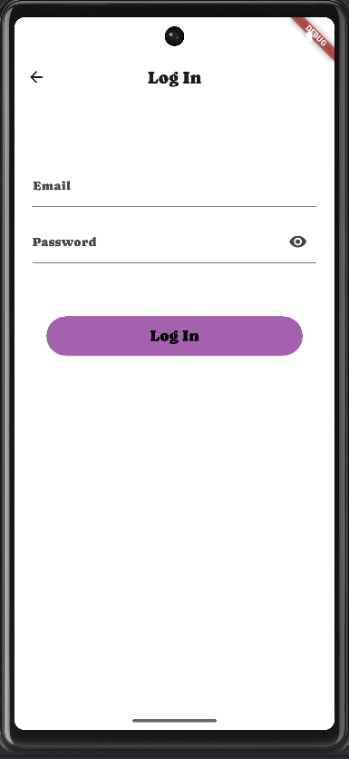
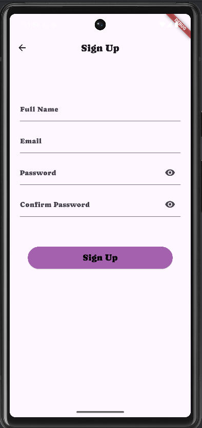
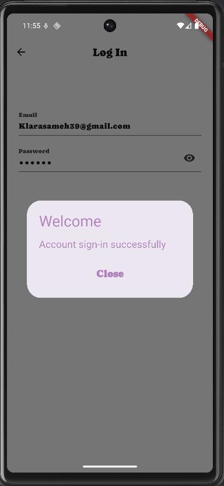
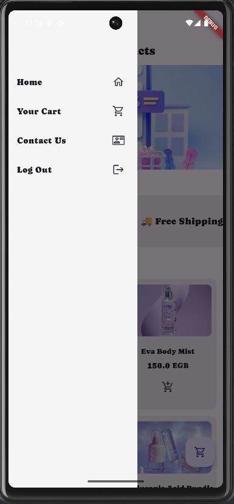
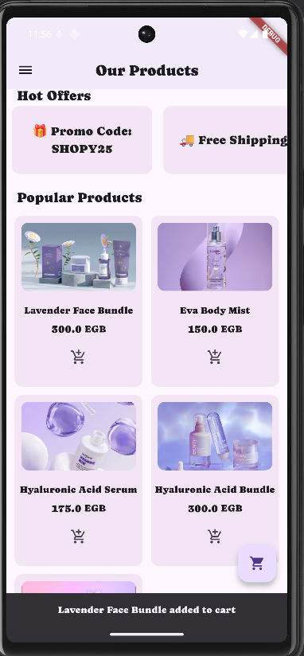

# 🛍️ ShoppingApp

- A simple Flutter shopping app built as a final project for Sprints program then continued improving it .
- Browse products, view hot offers, and manage your shopping cart easily.

---

## ✨ Features
- ✅ Browse popular products
- ✅ Hot offers slider
- ✅ Add/remove products to cart
- ✅ Cart page with quantity control and total price calculation
- ✅ Simple product detail dialog on tap

---

## 📸 Screenshots

| Welcome Page | Signing in| Signing up | Logged in |
|-----|-----------------|-----|-----|
|  |  |  |  |

| Home Page | Drawer options|
|-----|-----------------|
|  |  |  |

| Added Product | Cart Page|
|-----|-----------------|
|  |  | 


---


## 📦 Installation & Run

```bash
# Clone the repository
git clone https://github.com/klarasameh1/ShoppingApp-SprintsUp.git

# Navigate into the project directory
cd ShoppingApp-SprintsUp

# Get dependencies
flutter pub get

# Run the app
flutter run
